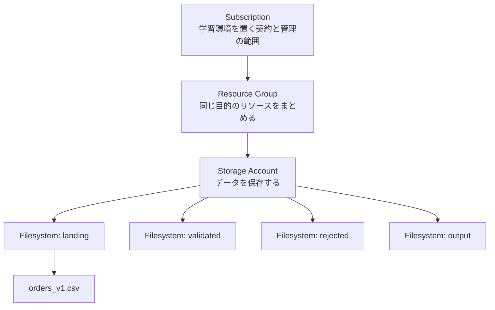
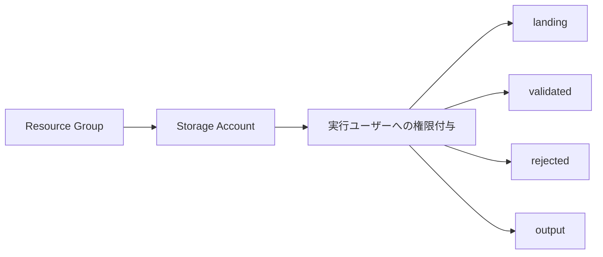

# CSVの保存先から理解するTerraformとAzure Storage

`orders_v1.csv`をAzureへ置き、ダウンロードすると元の内容と一致する。
Phase 1で確かめた動作は、この短い往復です。
そのために書いたTerraformには、保存先の設定に加えて、名前の受け渡しやアクセス権限の指定も含まれています。

この解説は、プログラムの変数やファイルの読み書きには触れたことがあり、TerraformとAzureの構成をこれから理解する読者を想定しています。
実装したコードを小さく抜き出し、CSVを置けるようになるまでのつながりを追います。
コマンドは意味を説明するために掲載しています。
実際に操作するときの順序と承認条件は、[学習計画のPhase 1](../learning-plan.md#phase-1-storage)を参照してください。
本文は上から順に読み、最後の補足はシェルの記号などで立ち止まったときに使えます。

- [CSVを置く場所](#1-csvを置く場所)
- [Terraformのコードと変数](#2-resourceブロックの読み方)
- [リソース同士の参照](#4-storageをresource-groupにつなぐ)
- [Azureへの接続と権限](#5-terraformからazureへ接続する)
- [4つのFilesystemと作成順序](#7-4つのfilesystemを定義する)
- [planとapplyの読み方](#8-planからapplyまでを読む)
- [CSVで確かめたこと](#9-csvの読み書きとno-changes)
- [必要になったときに読む補足](#補足シェル記法と検証用ファイル)

## 1. CSVを置く場所

手元のサンプルは、注文情報を並べたCSVです。
[元ファイル](../../samples/valid/orders_v1.csv)の先頭には、次の内容が入っています。

```csv
order_id,customer_id,amount,currency,ordered_at
10001,C001,12800,JPY,2026-08-27T10:30:00
```

このファイルを保存するAzure側のリソースが、**Storage Account**です。
保存したデータへのアクセス方法や、どの地域で保持するかなどを設定できます。

今回のStorage Accountの中では、**Filesystem**を作り、その中にファイルを置きます。
今回の保存先を、管理上のまとまりも含めて描くと次のようになります。



図の上側にある**Subscription**は、課金やアクセス権限を管理する範囲です。
その中に**Resource Group**を作り、同じ目的で管理するリソースをまとめます。
今回は、学習用Storage Accountを一つのResource Groupに入れています。

一方、図の下側にある`landing`がCSVの直接の保存先です。
ここでのFilesystemは、Azure Blob Storageのコンテナーに対応します。
Portalでは「コンテナー」という名前でも表示されるため、両方の呼び方を知っておくと同じ保存先を見つけられます。
Filesystemの中には、さらにディレクトリやファイルを置けます。[MicrosoftのADLSの説明](https://learn.microsoft.com/azure/storage/blobs/data-lake-storage-introduction)

Phase 1では、この図の保存先を作り、`landing`への読み書きを確認しました。
CSVの内容を検証して他のFilesystemへ振り分ける処理は、後続のPhaseでつながります。
各保存領域の役割は、[アーキテクチャのストレージ領域](../architecture.md#ストレージ領域)に定義されています。

## 2. resourceブロックの読み方

Resource Groupの名前と配置先は、Terraformでは次のように表現できます。
これは[実際の`main.tf`](../../infra/terraform/main.tf)から名前と配置先に絞り、入力値を具体的な文字列に置き換えた説明用の例です。

```hcl
resource "azurerm_resource_group" "lab" {
  name     = "rg-example"
  location = "japaneast"
}
```

波括弧で囲まれたひとまとまりが、**resourceブロック**です。
この例は「名前が`rg-example`、配置先が`japaneast`であるResource Groupを管理する」という希望する状態を表します。
Terraformは、このような構成を書くためにHCLという言語を使います。

先頭の行と`name`には、別々の名前が登場しています。
それぞれが指す対象を分けて読むと、コードの形が見えてきます。

| 記述 | 意味 |
|---|---|
| `azurerm_resource_group` | 管理するリソースの種類。AzureのResource Groupを表す |
| `lab` | Terraformのコードの中で、このリソースを指すための名前 |
| `name = "rg-example"` | Azure上に作るResource Groupの名前 |

Terraform内での識別子は、種類と名前をつないだ`azurerm_resource_group.lab`になります。
別の種類のリソースにも`lab`という名前を付けられるため、今回のStorage Accountは`azurerm_storage_account.lab`です。
この二つを、Terraformは別のリソースとして扱います。[resourceブロックの構文](https://developer.hashicorp.com/terraform/language/resources/syntax)

なお、`.tf`ファイルにこのブロックを書いただけでは、Azure上にResource Groupはできません。
作成するための操作は、後で出てくる`apply`です。

## 3. 環境ごとの名前を変数にする

実際のコードでは、Resource Groupの名前を直接書かず、入力から受け取っています。

```hcl
resource "azurerm_resource_group" "lab" {
  name     = var.resource_group_name
  location = var.location
  tags     = var.tags

  # この抜粋では、接続先を確認する条件を省略している。
}
```

`var.resource_group_name`は、`resource_group_name`という**入力変数**の値を参照する記法です。
`name`の右側に、環境ごとに変えたい値を渡せます。

入力の定義は[`variables.tf`](../../infra/terraform/variables.tf)にあります。
たとえば、名前の変数は次のように宣言されています。

```hcl
variable "resource_group_name" {
  description = "この学習環境で新規作成するResource Group名。"
  type        = string
  nullable    = false
}
```

`type = string`は文字列を受け取る指定です。
`nullable = false`は`null`を受け取らない指定で、この変数には既定値もないため、利用側で名前を渡す必要があります。
`description`には、その入力の用途が書かれています。

その値をまとめて渡すファイルが、**`terraform.tfvars`**です。
たとえば、このファイルに次の値があれば、Resource Groupの`name`に使われます。

```hcl
resource_group_name = "rg-example"
```

値が渡る順番は、次のとおりです。

```text
terraform.tfvarsの resource_group_name
              ↓
      var.resource_group_name
              ↓
    Resource Groupの name
```

名前を変えるときに入力だけを変更でき、Storageの種類や接続関係を定義したコードを共通に使えます。
同様に、`var.location`は配置先を、`var.tags`は管理用の名札となるキーと値の組を渡します。
タグによってファイルの保存場所が変わるわけではありません。

ここまでの`variable`と`resource`は別ファイルに置かれていますが、Terraformは同じディレクトリ内の`.tf`をまとめて読みます。
`variables.tf`や`main.tf`というファイル名は、内容を見つけやすくするための整理です。

## 4. StorageをResource Groupにつなぐ

Storage Accountを作るには、所属するResource Groupを指定する必要があります。
[`storage.tf`](../../infra/terraform/storage.tf)では、その部分を次のように書いています。

```hcl
resource "azurerm_storage_account" "lab" {
  name                = var.storage_account_name
  resource_group_name = azurerm_resource_group.lab.name
  location            = azurerm_resource_group.lab.location

  # この抜粋では、Storage固有の設定を省略している。
}
```

`resource_group_name`の右側を、三つに分けて読んでみます。

```text
azurerm_resource_group . lab . name
     リソースの種類      識別名   そのリソースの名前の値
```

ここでの意味は「先ほど定義したResource Groupの名前を使う」です。
同じ文字列を二か所へ書かず、参照でつなぐことで、所属先の指定がResource Groupの定義に追従します。

この参照から、Terraformは作成順序も読み取ります。
StorageがResource Groupを必要とするため、Resource Groupの作成を先に行います。
今回のapplyでも、Resource Groupの作成完了後にStorageの作成が始まりました。

### ADLS Gen2を有効にする設定

Storage Accountの中には、ファイルを保存する際の構造を選ぶ設定もあります。
今回、データ分析向けにディレクトリを扱えるようにしたのが、この行です。

```hcl
is_hns_enabled = true
```

**HNS（Hierarchical Namespace）**は、ディレクトリの階層を扱うための機能です。
これを有効にしたBlob Storageで、**ADLS Gen2（Azure Data Lake Storage Gen2）**の機能を利用します。
Storage Accountを土台にして、その上にデータ分析向けの保存機能を持たせる構成です。[ADLSの概要](https://learn.microsoft.com/azure/storage/blobs/data-lake-storage-introduction)

性能や複製の方式は、別の設定で指定しています。

```hcl
account_tier             = "Standard"
account_replication_type = "LRS"
access_tier              = "Hot"
```

`Standard`は標準の性能区分、`Hot`は頻繁にアクセスするデータ向けのアクセス層です。
今回のように小さなCSVを投入してすぐ読み返す用途を、この設定で扱います。

`LRS`は、単一のデータセンター内に複製を持つ方式です。
別拠点にも複製を持つ方式とは、障害への備えが異なります。[Azure Storageの冗長化](https://learn.microsoft.com/azure/storage/common/storage-redundancy)
本プロジェクトでの構成選択は、[学習環境の制約](../project-brief.md#学習環境の制約)に沿っています。

## 5. TerraformからAzureへ接続する

Resource GroupやStorageのコードを、Azureへの操作に変換する担当が必要です。
TerraformにAzure向けの機能を追加する**AzureRM Provider**が、その役割を持ちます。

```text
手元の.tfファイル
       ↓
Terraformが構成と依存関係を読む
       ↓
AzureRM ProviderがAzureのAPIを呼ぶ
       ↓
Azure側でリソースを作成する
```

APIは、プログラムからAzureへ操作を依頼する窓口です。
その窓口を呼ぶためのProviderを、[`versions.tf`](../../infra/terraform/versions.tf)の`required_providers`で選びます。
Providerの入手は、後述する`terraform init`が担当します。

### ログインした人と接続先を指定する

今回、AzureへのログインにはAzure CLIを使いました。
ログインした人の本人確認を扱うのが、Microsoft Entra IDです。
AzureRM Providerは、このログイン済みユーザーの認証を利用してAzureへアクセスします。

そのうえで、どのSubscriptionを操作するかを[`providers.tf`](../../infra/terraform/providers.tf)で指定しています。

```hcl
provider "azurerm" {
  features {}

  subscription_id = var.subscription_id

  # この抜粋では、Provider登録とデータ認証の設定を省略している。
}
```

`features {}`はAzureRM Providerの動作設定を置くブロックで、今回は中に追加設定を入れていません。
`subscription_id`は接続先のIDを指定します。
ログインは「誰が操作するか」、Subscription IDは「どこを操作するか」を決めています。

Subscription IDは、今回の実行手順では環境変数から渡します。
シェルに用意した値をTerraformの入力変数へ渡すため、`TF_VAR_`という接頭辞を使います。

```bash
export TF_VAR_subscription_id="$ARM_SUBSCRIPTION_ID"
```

この行は、事前に取得した`ARM_SUBSCRIPTION_ID`の値を、Terraformが入力変数として読む名前へ渡しています。
`TF_VAR_`の後ろにある`subscription_id`が、HCLの`variable "subscription_id"`と対応します。
Terraformはそれを`var.subscription_id`として参照します。

### 接続先の情報を取得して確認する

IDを渡したあとには、そのIDがどのSubscriptionを指しているかも確認します。
Azureにすでにある情報を取得する宣言が、**dataブロック**です。

```hcl
data "azurerm_subscription" "current" {
  subscription_id = var.subscription_id
}
```

このブロックは、渡されたIDのSubscription情報を読み取ります。
Resource Groupを作る`resource`と異なり、この`data`は新しいSubscriptionの作成を指定していません。

取得した名前は`data.azurerm_subscription.current.display_name`で参照できます。
実装では、この値を`main.tf`の`precondition`（実行前に満たす条件）で照合し、学習用の接続先と一致しなければplanを失敗させます。
Subscriptionを分けた判断の理由は、[ADR-0001](../adr/0001-isolate-learning-subscription.md)に記録されています。

### Azure側にもResource Providerがある

AzureでStorageのAPIを使えるようにするため、今回の前準備では`Microsoft.Storage`を登録しました。
これはAzure側の**Resource Provider**という仕組みで、手元に入れるAzureRM Providerとは別の役割です。

| 呼び方 | 今回の名前 | 担当する場所と役割 |
|---|---|---|
| Terraform Provider | `hashicorp/azurerm` | Terraformの実行環境で、Azure向けの操作を処理する |
| Azure Resource Provider | `Microsoft.Storage` | Azure側で、Storageのリソースに関するAPIを提供する |

`Microsoft.Storage`の登録は、対象SubscriptionでそのAPIを利用するための準備です。
Storage Accountそのものは、後のapplyで作成されます。[Azure Resource Providerの説明](https://learn.microsoft.com/azure/azure-resource-manager/management/resource-providers-and-types)

今回のコードはProviderによる自動登録を無効にし、登録操作を前準備へ分けています。
そのため、登録の完了を確かめてから、リソースのplanへ進む手順になっています。

## 6. Storageを作る権限とCSVを読み書きする権限

Storage Accountを作成できても、同じ認証でCSVを書き込めるとは限りません。
Azureでは、リソースの設定を管理する操作と、中に保存したデータを扱う操作に、それぞれ権限があります。

今回の実行ユーザーは`Owner`という管理用ロールを持っていました。
このロールでStorageの作成や権限の付与はできますが、Entra認証でデータへアクセスするための権限は別に付ける必要があります。[Microsoftのデータアクセス権限の説明](https://learn.microsoft.com/azure/storage/blobs/assign-azure-role-data-access)

そこで、[`storage.tf`](../../infra/terraform/storage.tf)には、Storage本体に加えて次の定義があります。

```hcl
resource "azurerm_role_assignment" "operator_blob_data" {
  scope                = azurerm_storage_account.lab.id
  role_definition_name = "Storage Blob Data Contributor"
  principal_id         = data.azurerm_client_config.current.object_id
  principal_type       = "User"
}
```

この**Role Assignment**は、権限の割り当てを一つのリソースとして管理します。
三つの指定を、人の操作に置き換えると次のように読めます。

| 指定 | 読み方 |
|---|---|
| `principal_id` | 誰に権限を付けるか。今回はTerraformを実行したユーザー |
| `role_definition_name` | どの操作を許可するか。今回はFilesystemの作成やデータの読み書きに使うロール |
| `scope` | どの範囲に権限を付けるか。今回は新設するStorage Account |

`data.azurerm_client_config.current.object_id`は、現在の接続で認証されたユーザーのIDを読み取った値です。
先ほどのSubscription情報と同じように、`data`で取得した情報を参照しています。

一方、`scope`の右側は、作成するStorage Accountへの参照です。
そのため、この割り当てによって実行ユーザーがデータを扱える範囲は、そのStorageに限定されます。
後のPhaseでAzure上の処理プログラムへ権限を付けるときにも、「誰に、何を、どこまで許可するか」という三つの読み方が使えます。

### データへのアクセス方法も揃える

権限を付けたら、その権限を使う認証方法でStorageへアクセスする必要があります。
[`providers.tf`](../../infra/terraform/providers.tf)の次の設定が、TerraformによるStorageのデータ操作でEntra認証を使う指定です。

```hcl
storage_use_azuread = true
```

プロパティ名には`azuread`が残っていますが、説明上のサービス名はMicrosoft Entra IDです。
Azure CLIでCSVを読み書きするときは、同じ意図を`--auth-mode login`で指定します。

Storage Account側では、`shared_access_key_enabled = false`により、アカウントキーを使う認証を無効にしています。
今回は「ユーザーに権限を付ける設定」と「そのユーザーの認証を使う設定」を組み合わせて、データへアクセスできる状態にしました。

## 7. 4つのFilesystemを定義する

Storage Accountと権限が用意できたら、その中に`landing`などの保存領域を作れます。
[`storage.tf`](../../infra/terraform/storage.tf)では、四つの名前を一つのブロックに渡しています。

```hcl
resource "azurerm_storage_data_lake_gen2_filesystem" "zones" {
  for_each = toset(["landing", "validated", "rejected", "output"])

  name               = each.value
  storage_account_id = azurerm_storage_account.lab.id

  depends_on = [azurerm_role_assignment.operator_blob_data]
}
```

ここでの**`for_each`**は、渡された名前ごとにリソースを定義するための指定です。
`toset(...)`は、四つの文字列を、重複と順序を持たない集合へ変換しています。
この書き方では、名前がそれぞれのFilesystemを識別するキーになります。[for_eachの説明](https://developer.hashicorp.com/terraform/language/meta-arguments/for_each)

`each.value`には、それぞれの名前が入ります。
たとえば`landing`について評価すると、`name = "landing"`のFilesystemが定義されます。
Terraformは、それを次の識別子で追跡します。

```text
azurerm_storage_data_lake_gen2_filesystem.zones["landing"]
```

ほかの三つにも、それぞれの名前をキーにした識別子が付きます。
一つのブロックから四つの管理対象が生まれるため、先頭の`resource`ブロックを数えるだけでは、作成される個数と一致しません。

### 権限への依存を明示する理由

同じブロックには、二種類の依存が書かれています。
まず、`storage_account_id`からStorage Accountを参照しているため、TerraformはStorageの作成完了を待ちます。

ただ、保存先が存在していても、データ用の権限がなければFilesystemの作成操作は通りません。
そこで、値の参照だけでは表れない依存を、**`depends_on`**で指定します。

```hcl
depends_on = [azurerm_role_assignment.operator_blob_data]
```

この指定を含めると、今回の作成順序は次のようになります。



四つのFilesystemの間には、互いの作成を待つ関係がありません。
今回の実行でも、権限付与の完了後に四つの作成が並列に始まりました。
コード上の並び順ではなく、この依存関係が実行順序を決めています。

なお、Azureで権限の割り当てが完了してから、実際のアクセスに反映されるまでには時間差が生じる場合があります。
`depends_on`が待つのは、Terraformから見た権限付与の処理完了です。
反映待ちが必要になった場合の扱いは、[適用手順](../learning-plan.md#5-承認されたplanを適用する)にあります。

## 8. planからapplyまでを読む

Resource Group、Storage、権限、Filesystemの宣言がそろいました。
このコードをAzure上の構成にする操作は、準備、差分の確認、適用に分かれます。

### initでProviderを用意する

最初の`init`は、このディレクトリでTerraformを使うための準備です。
選択したProviderの取得や、後述するstateの保存先の初期化を行います。

```bash
terraform -chdir=infra/terraform init
```

`-chdir=infra/terraform`は、Terraformが構成を読むディレクトリの指定です。
このリポジトリでは、複数の`.tf`をそのディレクトリにまとめています。

準備を終えると、設定したリソースを扱えるようになります。
`init`だけでStorageの作成まで進むことはありません。

### planで作成予定を確かめる

構成を実際のAzureと照合し、必要な変更を求める操作が**plan**です。
初回は対象リソースがまだ存在しないため、作成する差分が出ます。

```bash
terraform -chdir=infra/terraform plan -out=phase1.tfplan
```

`-out=phase1.tfplan`は、算出したplanをファイルへ保存する指定です。
このファイルはTerraformのディレクトリ内に作られ、後で確認済みのplanを指定して適用できます。

今回のplanには、次の作成予定が含まれていました。
リソースの種類と個数に注目すると、コードとの対応が追えます。

| 作成するもの | 個数 |
|---|---:|
| Resource Group | 1 |
| Storage Account | 1 |
| 実行ユーザーへのRole Assignment | 1 |
| Filesystem | 4 |
| 合計 | 7 |

planの末尾に出た次の行は、この合計を表しています。

```text
Plan: 7 to add, 0 to change, 0 to destroy.
```

`add`が追加、`change`が既存リソースの変更、`destroy`が削除です。
個々のリソースの行では、先頭の`+`も作成予定を示します。

また、planには`(known after apply)`という表示もあります。
これは、Providerが作成処理などの結果から取得するため、planの時点では未確定としている値です。
参照先のリソースがどれかはコードで分かっていても、その属性の具体的な値までplanに出せるとは限りません。

今回の確認では、個数に加えて、接続先Subscriptionと、Storageや権限がどのリソースを参照しているかを照合しました。
planが作れたことと、その変更を実施すると判断することは別の段階です。

### applyで保存したplanを実行する

確認済みのplanにある変更をAzureへ反映する操作が**apply**です。
今回、承認後に実行したコマンドは次の形です。

```bash
terraform -chdir=infra/terraform apply phase1.tfplan
```

`phase1.tfplan`を指定しているので、保存した作成予定を使います。
その適用中に、先ほどの依存関係に沿ってAzureへ作成を依頼します。

成功時の実行結果は、次のとおりでした。

```text
Apply complete! Resources: 7 added, 0 changed, 0 destroyed.
```

この時点で、Terraformから依頼した七つの管理対象が作成されています。

### stateでコードと実リソースを対応づける

作成後にも、Terraformは「コード上の`azurerm_storage_account.lab`が、Azure上のどのStorageを指すか」を覚えておく必要があります。
その対応と、リソースの属性などを記録するのが**state**です。[Terraform stateの説明](https://developer.hashicorp.com/terraform/language/state)

```text
コード上の識別子
azurerm_storage_account.lab
          ↕ stateが対応を記録
Azure上に作成されたStorage Account
```

次にplanを実行するときは、この対応を使ってAzure上の対象を読み取り、現在の設定とコードから必要な変更を求めます。
stateだけを見て、Azureの実物を確認せずに一致と判断する仕組みではありません。

今回の`backend "local" {}`は、stateを手元のファイルに保存する選択です。
**backend**はstateの保存方法を受け持ち、ローカルでは`terraform.tfstate`が使われます。
このファイルには識別子や機密情報が含まれ得るため、保管とGit管理の扱いは[ローカル入力の手順](../learning-plan.md#2-ローカルの入力を用意する)を参照してください。

## 9. CSVの読み書きとNo changes

applyの成功後には、作った保存先へ実際にアクセスできるかを確認しました。
Terraformからのリソース作成が成功していても、投入するデータを間違えたり、別のパスを指定したりする可能性があるためです。

CSV配置の指定を、手元とAzureに分けて読むと次のようになります。

| 指定 | 今回の意味 |
|---|---|
| `--source samples/valid/orders_v1.csv` | 手元で読み取るファイル |
| `--account-name` | Azure側のStorage Account |
| `--file-system landing` | そのStorage内のFilesystem |
| `--path orders_v1.csv` | Filesystem内に付ける保存先のパス |
| `--auth-mode login` | ログイン済みユーザーのEntra認証を使う |

最終的な配置先は、次の関係になります。

```text
手元: samples/valid/orders_v1.csv
                  ↓ アップロード
Azure: Storage Account / landing / orders_v1.csv
```

Storage Account名は、コードの`output`から取得しました。
**output**は、Terraformが管理する値を、後の操作で取り出せるようにする宣言です。
[`outputs.tf`](../../infra/terraform/outputs.tf)では、Storageの名前を返すように定義しています。

```hcl
output "storage_account_name" {
  description = "CSV配置先のStorage Account名。"
  value       = azurerm_storage_account.lab.name
}
```

この値は、次のコマンドで取り出せます。

```bash
terraform -chdir=infra/terraform output -raw storage_account_name
```

ここで得た名前をAzure CLIへ渡すことで、作成したStorageを後続の操作で指定できます。
`-raw`は、値をそのまま文字列として取り出す指定です。

アップロード後は、同じAzure上のファイルを一時ファイルへダウンロードし、`cmp`で元ファイルと比較しました。
`cmp`はファイルをバイト単位で比較するコマンドです。
今回の比較は終了コード0となり、内容が一致しました。

さらに、CSVを置いた状態でもう一度planを実行したところ、結果は次のとおりでした。

```text
No changes. Your infrastructure matches the configuration.
```

ファイルを一つ追加しても、この結果になるのは、今回のTerraform構成が管理している対象にCSVを含めていないためです。
StorageやFilesystemは`resource`で定義されていますが、`orders_v1.csv`の内容は定義されていません。
この`No changes`は、管理している基盤の構成に変更が不要という意味です。

これで、冒頭のCSVを保存し、同じ内容で取り出せるところまでつながりました。
後続の入力検証では、この`landing/orders_v1.csv`を読み、カラムや値を調べる処理が加わります。

## 補足：シェル記法と検証用ファイル

実行手順には、Terraformの構成を読むための知識に加えて、シェルの省略記法も登場します。
手順中のコマンドで立ち止まったときは、その記号が何をしているかを次の対応で確認できます。

### 環境変数を渡す記法

```bash
export ARM_SUBSCRIPTION_ID="$(az account show --subscription Personal-Sandbox --query id -o tsv)"
export TF_VAR_subscription_id="${ARM_SUBSCRIPTION_ID:?Subscription IDを取得できていません}"
```

最初の行は、Azure CLIから取得したSubscription IDを環境変数に入れています。
`$(...)`は、中のコマンドを実行して、その出力を使う記法です。
`--query id`でIDだけを取り出し、`-o tsv`で値をテキストとして出力します。
`export`によって、その変数を後から起動するTerraformにも渡せます。

二行目の`${変数:?メッセージ}`は、変数が未設定または空なら、指定したメッセージを出してその展開をエラーにします。
IDを取得できなかった状態で、空の値を渡して先へ進めることを防いでいます。

### ファイル操作や長いコマンドの記法

| 記法 | 手順中での用途 |
|---|---|
| 行末の`\` | 長いコマンドを次の行へ続ける |
| `>` | コマンドの出力をファイルへ書き出す。同名ファイルがあれば上書きする |
| `umask 077` | 後から作るファイルについて、ほかのユーザーへの権限を与えないようにする |
| `mktemp` | 名前が衝突しない一時ファイルを作り、そのパスを返す |
| `cp -n` | コピー先がすでに存在する場合は上書きしない |

これらは、構成の値を変えるTerraformの構文ではありません。
実行用の入力や、比較するファイルを準備するために、シェルで使っています。

### planのJSONとjq

保存したplanを、プログラムから扱えるJSONとして取り出す操作が次のコマンドです。

```bash
terraform -chdir=infra/terraform show -json phase1.tfplan
```

手順中の**`jq`**は、そのJSONから必要な項目を取り出すために使っています。

今回のjqが取り出すのは、接続先の照合結果と、各リソースを追加するか変更するかといった操作一覧です。
Terraform 1.16で確認したplanでは、取得済みのSubscription情報が`prior_state`に入っていたため、その箇所を参照しています。
JSON全体の構造を覚えなくても、照合結果と操作一覧の意味が分かれば、planを確認する目的を追えます。

### ProviderのロックとCI

Providerを同じバージョンで再現するためのファイルが、`.terraform.lock.hcl`です。
ここには選択したバージョンと、入手したパッケージを確認するチェックサムが記録されます。
このロックファイルの役割は、Azure上のリソースとの対応を記録するstateとは異なります。

今回、手元のMacとGitHub ActionsのLinuxで、Providerのパッケージが異なりました。
そこで、両方の環境のチェックサムを記録しています。

GitHub Actionsで実行する継続的な検証を、**CI**と呼びます。
今回のCIは書式や構成を確認し、Azure APIをモック（実際の呼び出しを代わりの応答に置き換えること）にしたテストで、Subscriptionの取り違えを拒否できるかを確かめます。
実際のAzureで権限が通るか、CSVを読み書きできるかは、先ほどの実環境での確認が受け持っています。
